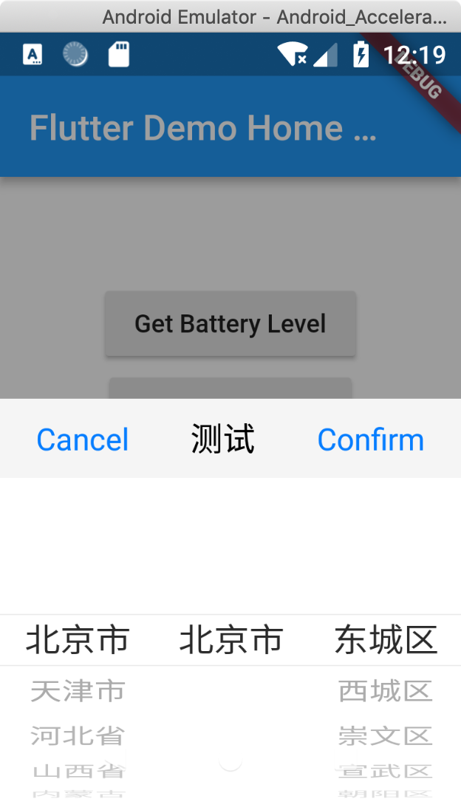

# province_provider

Province Picker
根据[Android-PickerView](https://github.com/Bigkoo/Android-PickerView)进行的Flutterplugin

## Getting Started

### dependency
```
province_provider:
    git:
      url: git@github.com:skeyboy/provinece_picker.git
      tag: 0.0.1
```
### init
```

import 'package:province_provider/province_provider.dart';

ProvinceProvider provinceProvider = new ProvinceProvider();


 provinceProvider.provinceCallback(_handler);
 
 Future<dynamic> _handler(MethodCall methodCall){
 
     if(methodCall.method == "provinceResult"){
       Map<dynamic, dynamic> result = methodCall.arguments;
       var type = result["type"];
       if(type == "province"){
 setState(() {
   Map<dynamic, dynamic> info = result["value"];
   _platformVersion = "$info";
 });
       }
     }
     return Future.value(true);
   }

```
### Call
```
Future<void> show() async {
String platformVersion = "None";

final dynamic result = await provinceProvider.showProvinceProvider("选择籍贯");
setState(() {
  _platformVersion = "$locationInfo";
});

//UI action
 RaisedButton(
            child: Text('Get Battery Level'),
            onPressed: show,
          ),
```

### show

